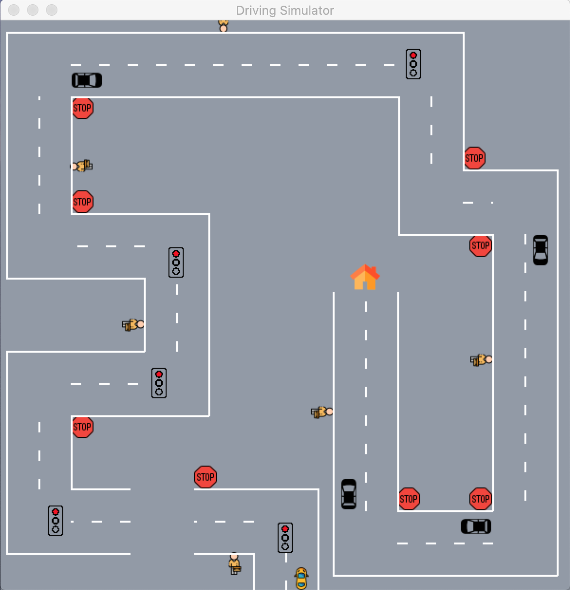

# Driving Simulator

This driving simulator features a virtual autonomous vehicle that navigates a virtual map from a starting to a destination location. The vehicle interacts with common road artifacts using standard driving conventions. The simulator allows the programmer configure the virtual maps, which are made up of roads and road artifacts (stop signs, traffic lights, pedestrians, and other vehicles).

I'm a long-time programmer who is transitioning from developing office applications to autonomous vehicle engineering. 

I was inspired to work on autonomous vehicles after seeing a documentary on the [DARPA 2005 Grand Challenge](https://www.youtube.com/watch?v=vCRrXQRvC_I), which was the first long distance competition for driverless cars and helped jump start the field of autonomous vehicle engineering. 

I'm currently enrolled in the [Udacity.com Autonomous Vehicle Engineering Nano Degree program](https://www.udacity.com/school-of-autonomous-systems). It's a great program with comprehensive instruction and lots of projects. After completing the first few courses in the program I thought it would be fun to build a scale-model autonomous vehicle that could potentially complete Grand Challenge like courses that I'd build in my home and backyard. 

After learning that Google/Waymo has a software simulator that allows engineers to test their driving algorithms before running them on public roads, I decided to start with this software simulator. 

This project has allowed me to explore key autonomous vehicle software issues such as, 
* vehicle control,
* route planning,
* vehicle interaction with road artifacts, such as street signs, pedestrians, and other vehicles, and 
* designing an extensible administrative system that allows the various (pseudo) vehicle control systems and sensors to efficiently operate together. 

After completing the next phase of my coursework, I plan to build the actual scale-model car. Although I'll write the software for the model in C++ (rather than Python), I plan to base the software for the model on the architecture and algorithms I worked out in this project. 

## Table of Contents

* [Dependencies and Pre-requisites](#dependencies-and-pre-requisites)
* [Installation](#installation)
* [Usage](#usage)
* [Known Issues](#known-issues)
* [Future Plans](#future-plans)
* [Support](#support)
* [Contributing](#contributing)
* [Authors and Acknowledgement](#authors-and-acknowledgement)
* [License](#license)

## Dependencies and Pre-requisites
* Python 3.7
* PyGame 1.9.6

## Installation

Copy the library, including the "images" folder to a directory.

## Usage

### Configure the maps_defs.py file

The *map_defs.py* file contains functions that allow maps to be configured. Maps include the roads and road artifacts that the simulated car will drive on and interact with. You can reconfigure several existing maps or create new maps.

#### load()

The *load()* function specifies the maps that will be loaded when the simulator is run. The simulator loads the first map in the list, drives the car through the map, then cycles through the configured roads until you manually exit the program.

```
def load():
    add_map(1, load_map(map0))
    add_map(2, load_map(map0))
    add_map(2, load_map(map1))
    add_map(2, load_map(map2))
    return maps
```

##### add_map(lane_count, map_parms)

Adds a specific map to the list of maps that will be executed when the simulator runs.

Parameters:
* lane_count (integer) - the number of lanes that will appear in the roads of the map.
* map_parms (tuple(road_parms, road_artifact_parms)) - the road_parms and road_artifact_parms for maps are defined in *map#()* functions. The *load_map()* function is used to call particular *map#()* functions.

##### map#()

Specifies the roads and road artifacts that will appear in a particular map. 

The roads appear in the order in which they are defined by the *add_road()* functions. The road artifacts are assigned to the road most recently specified by a call to *add_road()*.

```
def map0():
    add_road(3, .75, 96)
    add_artifact("sign_traffic_light", 0, 2, C)
    add_road(0, .75, 96)
    add_artifact("pedestrian", 1, 0, R)
    add_artifact("vehicle", 2, 2, 0)
    add_artifact("sign_stop", 0, 0, R)
    add_road(3, .75, 96)
    add_artifact("destination", 0, 2, C)
```

##### add_road(direction, length, speed)

Adds a road to a map.

Parameters:
* direction (integer) - the direction the car will drive on the road.
    * 0 - north
    * 1 - south
    * 2 - west
    * 3 - east
* length (float) - the length of the road in kilometers.
* speed (integer) - the speed the car will drive on the road in kilometers per hour.

##### add_artifact(type, segment, pos_length, pos_width)

Adds a road artifact to a road.

Parameters:
* type (str)
    * 'sign_stop' (fixed artifact) - causes the car to wait several seconds
    * 'sign_traffic_light' (fixed artifact) - causes the car to wait while lighted red
    * 'destination' (fixed artifact) - causes the car to wait several seconds before the simulator loads the next map.
    * 'pedestrian' (moving artifact) - simulates a person walking back and forth across the road.
    * 'vehicle' (moving artifact) - simulates a slow moving vehicle that repeatedly drives the length of the road in a particular lane.
* segment (integer) - the position on the road where the artifact will be initially placed.
    * 0 - end of road
    * 1 - center of road
    * 2 - beginning of road
* pos_length (integer) - the position relative to the segment where the artifact will be initially placed.
    * 0 - just before the segment
    * 1 - centered on the segment
    * 2 - just after the segment
* pos_width (integer or char) - the horizontal position where the artifact will be initially placed.
    * '#' - lane number beginning with 0 for right most lane
    * 'l' - just left of the road
    * 'c' - center of the road
    * 'r' - just right of the road

### Running
1. In a terminal, navigate to the directory containing the source files,
2. Execute `python3 simulator.py`.

**Sample Map**


## Known Issues

None.

## Future Plans

I plan to build a scale model fully autonomous car using this project as its software core.

## Support

Please open an issue to receive help.

## Contributing

Pull requests are welcome. Please open an issue to discuss any changes you would like to make or see.

## Authors and Acknowledgement

This project was designed and developed by Phyllip Hall.

## License

[MIT](https://choosealicense.com/licenses/mit/)
